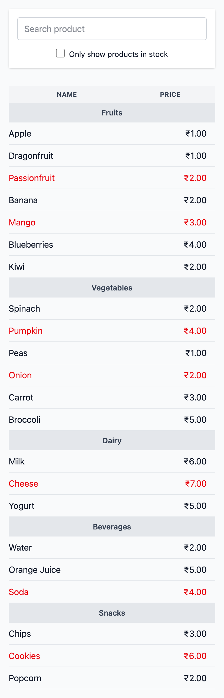
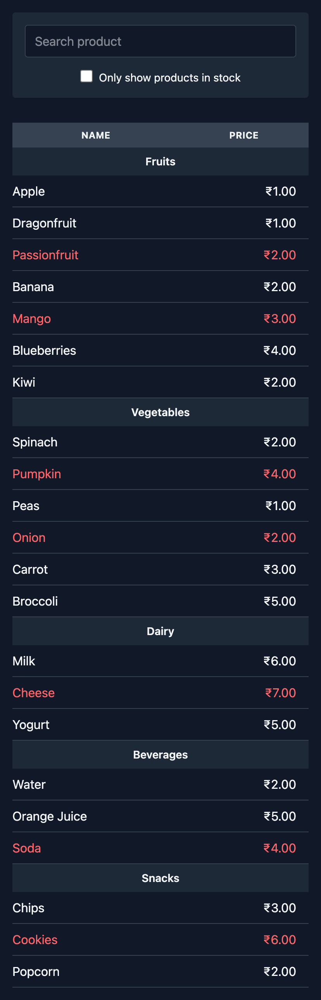

# 🛒 Filterable Product List (React + TypeScript)

A clean, accessible, high-performance product listing app built with React and TypeScript.

✅ Perfect Lighthouse score: 100 / 100 / 100 / 100  
✅ Mentor-reviewed codebase  
✅ Modular, scalable folder structure  
✅ Built with care, polished with pride ✨

---

## 🔥 Live Demo

> _[Link to be added after deployment]_

---

## 📸 Screenshots

| Light Mode                   | Dark Mode                   |
| ---------------------------- | --------------------------- |
|  |  |

---

## 🧩 Features

- Filter by name
- Show only in-stock toggle
- Grouped by category
- Built using `React`, `TypeScript`, and `Vite`
- Fully responsive and accessible
- Clean component structure
- Zero external UI libraries (yet 😉)

---

## 🛠️ Tech Stack

- React 19
- TypeScript
- Vite
- Lighthouse
- Future: Tailwind CSS, React Router, Context API

---

## 🚀 Versions

| Version  | Description                                                                         |
| -------- | ----------------------------------------------------------------------------------- |
| `v1.0.0` | Core product list with filtering & grouping. Mentor-reviewed. Lighthouse all green. |
| `v2.0.0` | Tailwind + responsive layout + visual polish                                        |
| `v3+`    | Routing, mock authentication, product CRUD (mocked)                                 |

---

## 🧠 Author

Made with ❤️ by [YOUR NAME]  
Guided by [My AI Code Mentor 🧙‍♂️]
